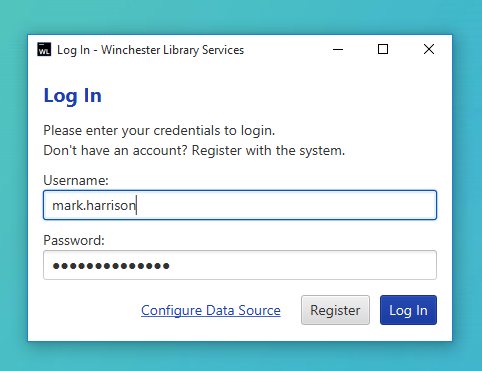
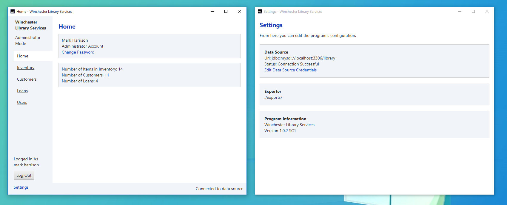
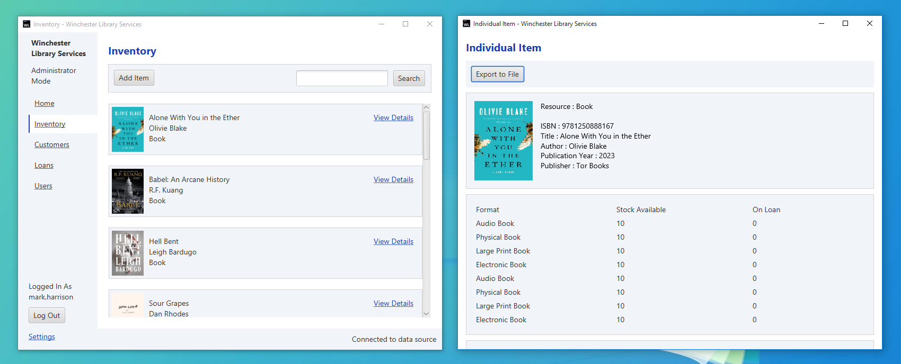
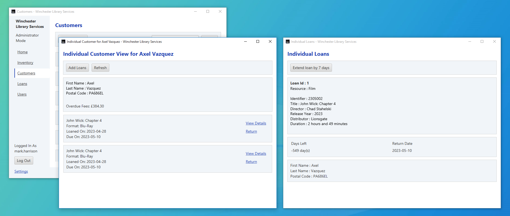
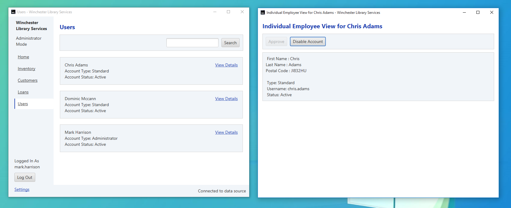

# Library Loans System (LLS)

## Overview

The "Library Loans System" is an application for intenal use within a library. This
"proof of concept" app allows the loaning of books and DVDs to customers of the library.
This was for the module BS2202 Object-Orientated Software Development at the University
of Winchester. The Original Hand-In was in May of 2022. **This project will not be**
**developed further.**

## Original Requirements

* The program must show the ability to loan more than one type of items that contains
multiple formats. This item should visually be shown through images.
* Each item should have a count of inventory and loan tracking (including details of
overdue items and fines).
* The program includes a login system with standard and admin accounts (subjected to
approval by an admin).
* The application is developed using Java following the object-orientated design using
inheritance, a database and a GUI which utilises JavaFX or AWT/Swing.

## Structural Overview

| Package        | Description                             |
| :------------- | :-------------------------------------- |
| `data.access`  | Database interactions.                  |
| `data.model`   | Represents data structures.             |
| `meta`         | Application metadata.                   |
| `service`      | Handles business logic and transitions. |
| `presentation` | Implementes graphical user interface.   |

## Database Setup

This program uses the MySQL Database Connector. A single SQL file can be used to build the
database (`./data/library.sql`) by running through the MySQL CLI or Workshop.

As this is a "proof of concept", login credentials are stored in the `DatabaseCredentials`
class. _This is not a secure way to store credentials. In production, you would use an_
_ORM instead of interacting with the driver directly._

## Execution

This project uses the Maven build tool to simplify handling dependencies and development
process. IDEs such as VSCode, IntelliJ IDEA and NetBrains support Maven.

## Usage

On startup, the login window allows the user to enter their credentials before displaying
the main part of the system. A member of staff can register but will have to approved by
an administrator before continuing to their account. In case of error, the window offers
options to temporarily change the database configuration.

After credentials are validated, the main window is displayed, with the home view with
a small summary of loans and items and the ability to change the password. This window
offers a settings page, allowing database credential changes, displaying program
information as well as where exports will be saved. The main window offers navigation
links to access different views within the system.

The inventory pages allows the addition of new DVDs and Books, or searching through these
items that are on the system. Viewing the details of an item shows general information and
the stock available and if any are on loan. The program can export all this information to
a text file.

The customers refer to the users loaning out the items in the library. It contains a list
of customers, which can searched through. Each customer has their own view displaying all
the loans and stating any overdue fees. Further details of each loan can be viewed and
having the option to extend.

The final page displays a list of staff that have accounts within the library system. This
is only visible to administative users, since within gives the ability to approve and
disable (or enable) accounts.

## References

* JavaFX (under GPL 2.0): <https://github.com/openjdk/jfx>
* MySQL Connector (under GPL 2.0 w/ FOSS Exception):
<https://github.com/mysql/mysql-connector-j>
* JUnit (under EPL 2.0): <https://junit.org/junit5/>
* JetBrains Annotations (Apache 2.0): <https://github.com/JetBrains/java-annotations>
